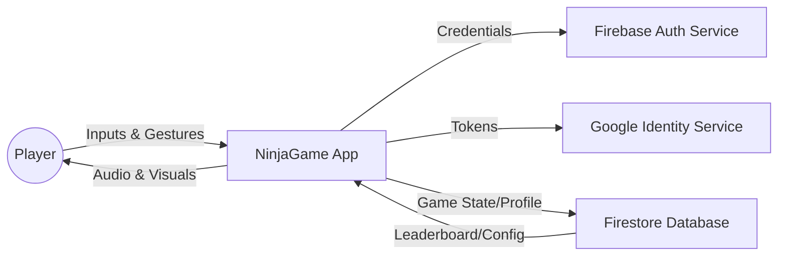
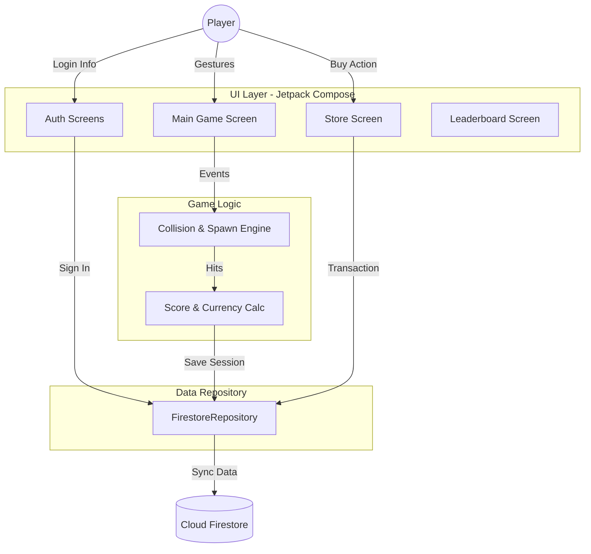

# Data Flow Diagram - NinjaGame

## Level 0: Context Diagram
The highest level view of the system's interactions with external entities.

## Level 1: Functional Diagram
Breakdown of major processes within the application.

## Level 2: Detailed Flows

### Authentication Flow
1. **User** provides credentials (Email/Password or Google).
2. **AuthScreen** sends data to `FirebaseAuth`.
3. Upon success, `FirestoreRepository` fetches/creates `UserProfile`.
4. **GameRoot** switches state to `Game1App`.

### Gameplay Loop & Save Flow
1. **Engine** spawns `Target` based on `Difficulty`.
2. **Player** moves and fires `Weapon`.
3. **Collision Detection** (in `MainGameScreen`) identifies hits.
4. **Game Over** triggers `repository.saveGameSession`.
5. **Firestore** updates `bestTimes` and `coins`.
6. **Announcement** is posted to the global feed if a new record is set.

### Store Transaction Flow
1. **StoreScreen** displays `StoreItem` list.
2. **User** clicks "Buy".
3. `FirestoreRepository` runs a **Transaction**:
    - Check if `coins >= price`.
    - Check if item is already unlocked.
    - Atomically decrement `coins` and add item to `unlockedWeapons`.
4. UI refreshes from the updated `UserProfile` snapshot.
