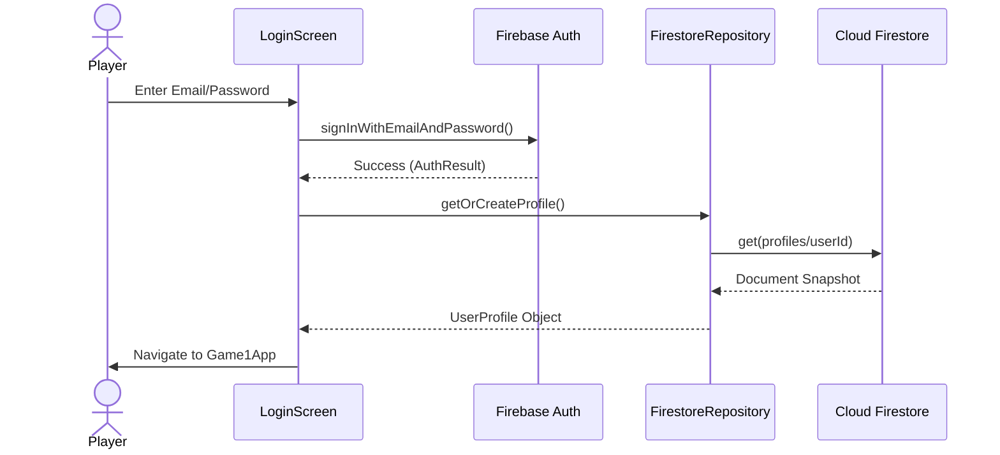
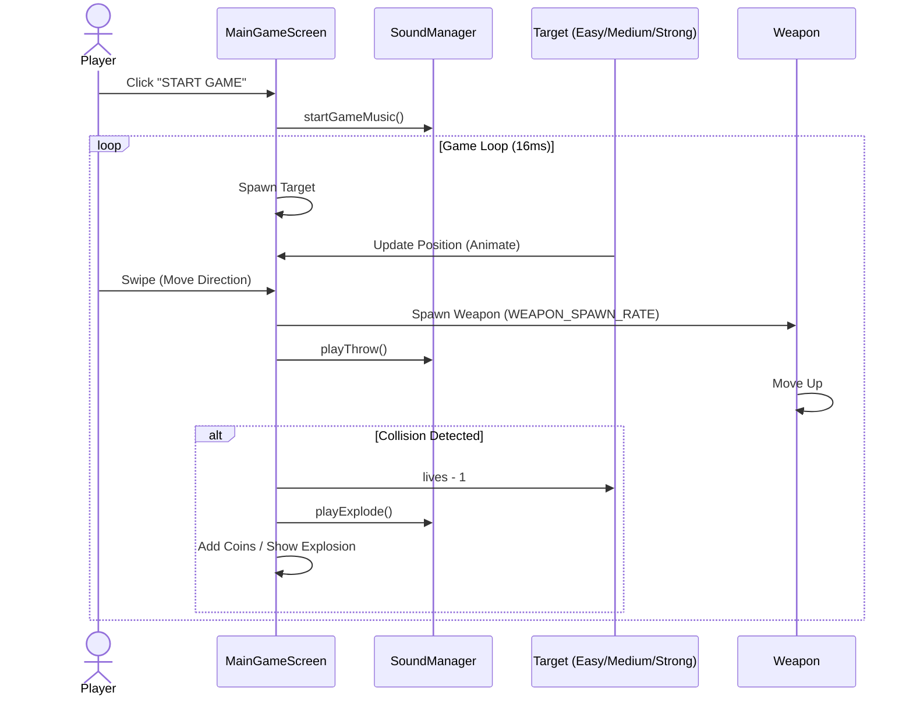
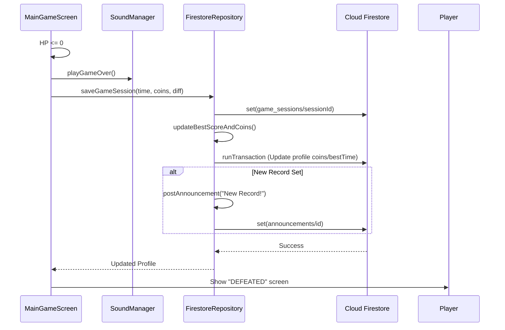
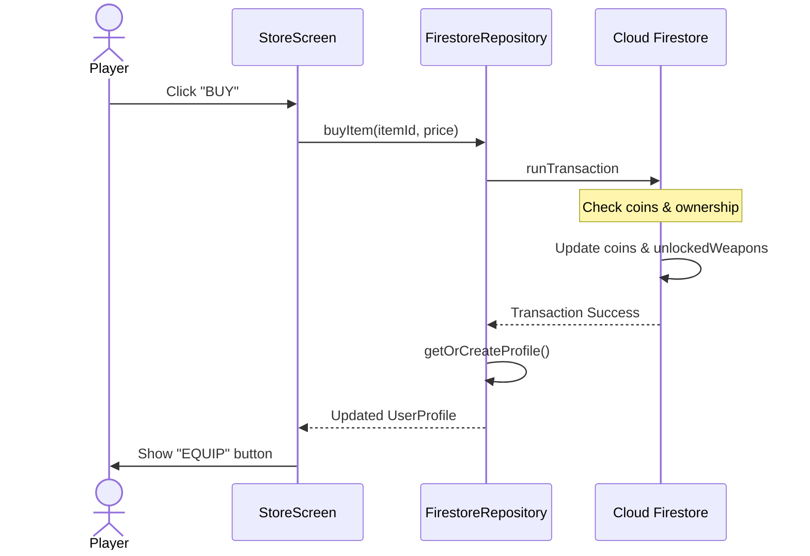
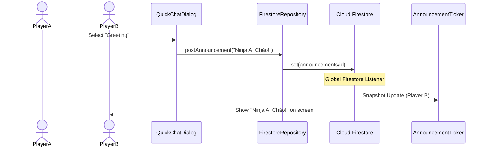

# Sequence Diagrams - NinjaGame

## 1. Authentication: Login Flow

## 2. Gameplay: Start Game & Target Interaction

## 3. Game Over & Data Persistence

## 4. Economy: Buying an Item

## 5. Social Sync: Quick Chat (Pseudo-Multiplayer)

